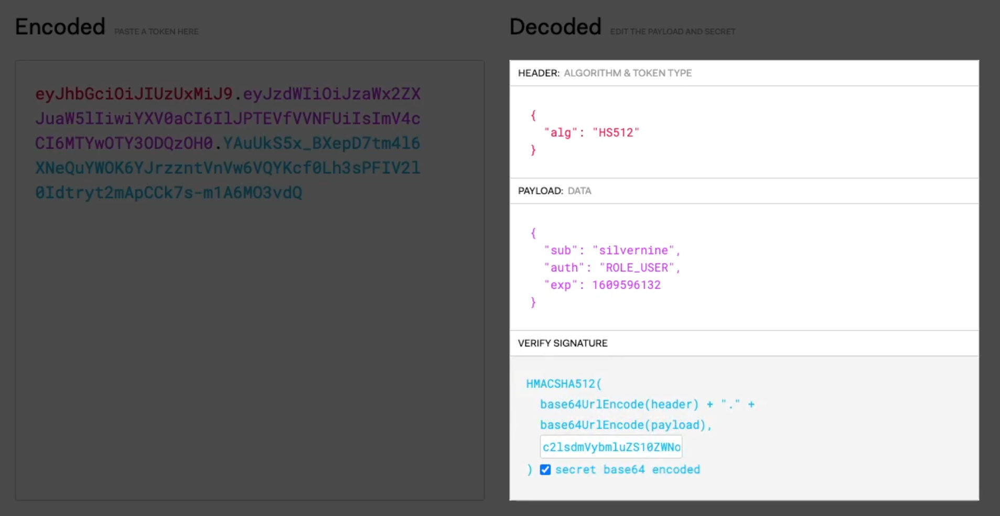

# SpringJWT Example

JWT는 Header, Payload, Signature 3개의 부분으로 구성

- <h2>Header</h2>  
Header는 Signature를 해싱하기 위한 알고리즘 정보들이 담겨있다.
- <h2>Payload</h2>  
Payload는  서버와 클라이언트가 주고받는, 시스템에서 실제로 사용될 정보에 대한 내용들을 담고있다.
- <h2>Signature</h2>  
 Signature는 토큰의 유효성 검증을 위한 문자열이다.
 

- <h2>JWT 장점</h2>
  * 중앙의 인증서버, 데이터 스토어에 대한 의존성 없음, 시스템 수평 확장 유리
  * Base64 URL Safe Encoding > URL, Cookie, Header 모두 사용 가능
- <h2>JWT 단점</h2>
  * Payload의 정보가 많아지면 네트워크 사용량 증가, 데이터 설계 고려 필요
  * 토큰이 클라이언트에 저장, 서버에서 클라이언트의 토큰을 조작할 수 없음
